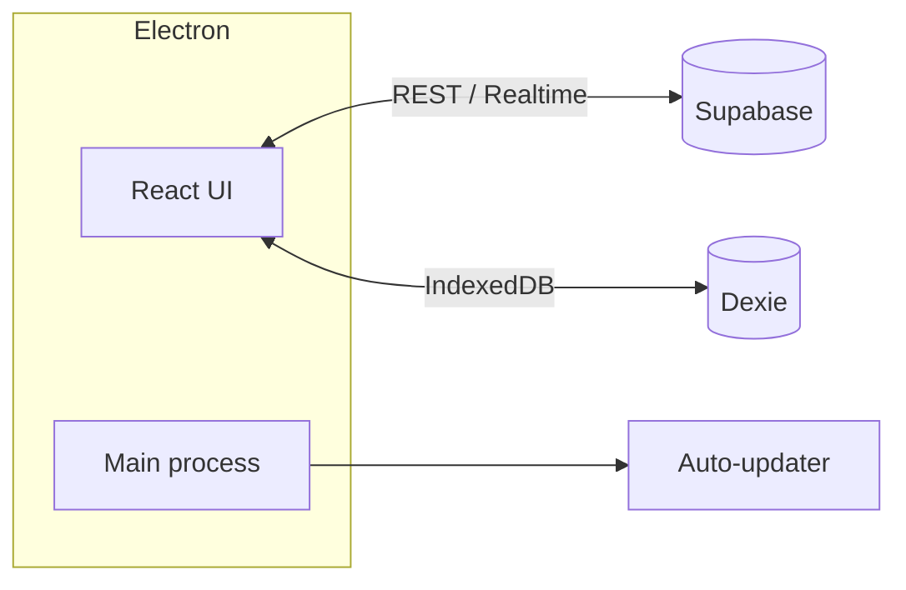

<pre align="center">
╔═══════════════════════════════════════════════════════════╗
║                                                           ║
║                ·  Umbrella Deadlock DB  ·                 ║
║                                                           ║
╚═══════════════════════════════════════════════════════════╝
</pre>

### A calm, dedicated window for Deadlock Lua scripts
Browse the catalog, open script details, sign in as an author, and keep the app fresh with built-in updates—without living inside a browser tab.

<picture>
  <source media="(prefers-color-scheme: dark)" srcset="https://img.shields.io/badge/platform-Windows-1f6feb?style=for-the-badge&logo=windows&logoColor=white">
  
</picture>

&nbsp;

&nbsp;

  

[**Download the latest build**](https://github.com/lilleke-rohus/UmbrellaDeadlockDB/releases) · [**Report an issue**](https://github.com/lilleke-rohus/UmbrellaDeadlockDB/issues)

 

---
## Why this exists

**Basically** I do not like Discord Forums. Every time the game updates and a script dev updates the script, you had to go to the forums, search for the correct thread and then scroll to see if the dev has updated the script. Now no more...
**Umbrella Deadlock DB** is the desktop front-end for the Umbrella script ecosystem in Valve’s **Deadlock**. It wraps the experience in an **Electron** shell, keeps the UI fast with **React**, and talks to **Supabase** for accounts, catalog data, and role-aware areas. **Dexie** backs the bits that belong on your machine—like catalog state that should survive restarts and feel instant.
If you only care about using it: grab a **release**, install, and go. The sections below are for curiosity and contributors.

---

## What you get

| | |
| :--- | :--- |
| **Catalog-first** | Find scripts, read details, and move through the library without context-switching. |
| **Signed-in flows** | Log in for author tools and anything that needs your identity on the server. |
| **Roles that matter** | Moderation and admin surfaces stay behind the right permissions—no accidental edits. |
| **Stays current** | The app checks for updates so you are not stuck on an old build. |

---

## Under the hood

---

## Get it

Prebuilt installers are attached to [**GitHub Releases**](https://github.com/lilleke-rohus/UmbrellaDeadlockDB). That is the path most people should use.

---

<strong>If you want to build for yourself</strong>

Technically you can use this project for any similar installer/storage. Like for Umbrellas Dota2 scripts, or some OTC scripts idk.

